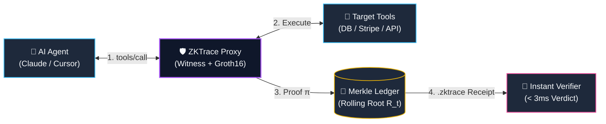

<div align="center">

# 🛡️ ZKTrace

### **Zero-Knowledge Cryptographic Audit Trail for AI Agents & MCP**

*Mathematically prove AI agent compliance, tool execution bounds, and safety policies without exposing confidential prompts, PII, API keys, or raw payloads.*

<br/>

[](https://opensource.org/licenses/Apache-2.0)
[](https://github.com/MuhammetEmirErkut/zk-trace/actions)
[](https://www.rust-lang.org)
[](https://eprint.iacr.org/2016/260)
[](https://modelcontextprotocol.io)
[](https://hub.docker.com)

<br/>

[💡 Why ZKTrace?](#-why-zktrace) •
[🌟 Features](#-unique-value-propositions) •
[🏗️ Architecture](#️-high-level-architecture) •
[🔬 Cryptography](#-cryptographic-specification) •
[🚀 Quickstart](#-quickstart-guide) •
[🐳 Docker](#-docker-deployment--multi-project-networking) •
[⚡ Benchmarks](#-performance-benchmarks) •
[🤖 AI Integration](#-ai-ide--assistant-integration)

---

</div>

<br/>

**ZKTrace** is a high-throughput Zero-Knowledge Proof (ZKP) audit trail and compliance layer for autonomous AI agents operating over the [Model Context Protocol (MCP)](https://modelcontextprotocol.io).

It solves the fundamental enterprise dilemma of AI agent execution: **How can you mathematically prove to auditors, regulators, and downstream systems that an AI agent obeyed safety boundaries (e.g. read-only SQL, spending limits $\le \$1,000$, whitelisted endpoints) without revealing confidential prompts, PII, API credentials, or proprietary payloads?**

---

## 💡 Why ZKTrace?

| Capability | Plaintext Loggers (Datadog, LangSmith) | Generic zkVMs (SP1, RISC Zero) | 🛡️ **ZKTrace** |
| :--- | :---: | :---: | :---: |
| **Privacy & PII Protection** | ❌ Logs plaintext prompts & data | ✅ Cryptographic ZK masking | ✅ **Zero raw data leakage** |
| **Proving Latency** | ⚡ None (unverifiable text) | ❌ 30s – 3 mins (heavy RAM) | ⚡ **< 40 ms (Real-time)** |
| **Verification Latency** | ❌ Manual log inspection | ⚠️ 50ms – 1s | ⚡ **< 3 ms (Instant)** |
| **MCP Protocol Support** | ⚠️ Custom SDK instrumentation | ❌ Requires custom zkVM guest code | ✅ **Zero-code JSON-RPC proxy** |
| **Audit Receipt Size** | ❌ Megabytes of JSON traces | ⚠️ 50KB – 200KB | 📦 **~128 Bytes (Compact)** |
| **Tamper Resistance** | ❌ Mutable centralized databases | ⚠️ Depends on storage | 🔒 **Poseidon Merkle Ledger** |

---

## 🌟 Unique Value Propositions

| Pillar | What It Delivers | Key Advantage |
| :--- | :--- | :--- |
| **🔒 Zero-Knowledge Proofs** | Generates **~128-byte** Groth16 proofs in **$< 40\text{ms}$**. | Full compliance without exposing internal prompts, PII, or API keys. |
| **⚡ Instant Verification** | Verifies proofs in **$< 3\text{ms}$** via CLI, SDK, or REST API. | Real-time mathematical audits for automated security gateways. |
| **🧩 Transparent MCP Proxy** | Zero-code JSON-RPC 2.0 middleware (`stdio`/HTTP). | Instant plug-and-play with Claude, Cursor, and custom AI agents. |
| **📜 Immutable Merkle Ledger** | Append-only IMT with Poseidon hashing over $\mathbb{F}_r$. | Tamper-proof, cryptographically verifiable history in `.zktrace` bundles. |

---

## 🏗️ High-Level Architecture

### End-to-End Execution & Audit Flow



### Privacy Boundary

```text
  [ Private Witness (Masked) ]  ──►  ┌────────────────────────┐  ──►  [ Public Audit Receipt ]
  • Prompts & PII                    │  Groth16 R1CS Circuit  │       • Policy Root & Proof π
  • Raw Queries & Secrets            │  Enforces Bounds & ZK  │       • Execution Digest & Time
                                     └────────────────────────┘
```

---

## 🔬 Cryptographic Specification

| Primitive | Implementation | Role |
| :--- | :--- | :--- |
| **zk-SNARK** | Groth16 over **BN254** (`ark-groth16`) | Compact ~128B proofs, sub-3ms verification. |
| **Hash Function** | Poseidon Permutation ($t=3, t=5$ on $\mathbb{F}_r$) | High-throughput, SNARK-friendly algebraic hashing. |
| **Public Inputs** | $(R_{\text{policy}}, D_{\text{exec}}, \text{AgentID}_{\text{hash}}, \text{SessionID}, \Delta t)$ | Verifiable public compliance boundary. |
| **Execution Digest** | $\text{Poseidon}(\text{ToolID}_{\text{hash}}, \text{ParamDigest}, \text{ResultCode}, t, \text{Nonce})$ | Cryptographic binding without leaking payload data. |

---

## 🚀 Quickstart Guide

### 1. Initialize Workspace & Keys
Generate trusted setup parameters (`prover.pk`, `verifier.vk`), default `policy.json`, and cryptographic ledger:
```bash
zktrace init --out-dir ./.zktrace
```

### 2. Configure Agent Policy (`policy.json`)
Define strict mathematical boundaries for tool operations:
```json
{
  "policy_id": "enterprise-compliance-policy",
  "version": 1,
  "rules": [
    {
      "tool_name": "stripe_payment",
      "tool_id_hash": "0x12a3b4c5...",
      "constraints": [
        {
          "param_name": "amount",
          "constraint": { "type": "MaxSpendLimit", "config": { "max_amount": 100000 } }
        }
      ],
      "description": "Payment tool with $1,000 max limit"
    }
  ]
}
```

### 3. Run Transparent MCP Proxy
Intercept and audit agent MCP tool invocations in real-time:
```bash
zktrace proxy --policy ./.zktrace/policy.json --ledger-dir ./.zktrace/ledger
```

### 4. Verify Proof Receipts ($< 3\text{ms}$)
Audit single `.zktrace` receipts or bundled execution ledgers locally:
```bash
zktrace verify ./audit_trail.zktrace
```

### 5. Launch REST API Verifier Server
Deploy a high-throughput verification daemon:
```bash
zktrace serve --host 0.0.0.0 --port 8080
```
Verify proof payloads over HTTP:
```bash
curl -X POST http://localhost:8080/v1/verify \
  -H "Content-Type: application/json" \
  -d @audit_trail.zktrace
```

---

## 🐳 Docker Deployment & Multi-Project Networking

ZKTrace includes native **Distroless healthcheck probes** and **`0.0.0.0` dynamic host binding** to guarantee zero network connection errors (`ECONNREFUSED`, DNS drops) when integrated across multi-container architectures.

### Run with Docker Compose
```bash
# Start verifier daemon with background health monitoring
docker compose up -d

# Check health probe status
docker compose ps
curl http://localhost:8080/health
```

### Zero-Race Multi-Container Integration
Use Docker's native `condition: service_healthy` to guarantee downstream services start only after ZKTrace is 100% operational:

```yaml
version: "3.8"

services:
  zktrace-verifier:
    image: zktrace/zktrace:latest
    container_name: zktrace-verifier
    restart: unless-stopped
    ports:
      - "8080:8080"
    command: ["serve", "--host", "0.0.0.0", "--port", "8080"]
    healthcheck:
      test: ["CMD", "/usr/local/bin/zktrace", "healthcheck", "--host", "127.0.0.1", "--port", "8080"]
      interval: 5s
      timeout: 3s
      retries: 5
      start_period: 3s
    networks:
      - app-network

  my-ai-service:
    build: .
    depends_on:
      zktrace-verifier:
        condition: service_healthy  # 💡 Prevents ECONNREFUSED startup race conditions
    environment:
      - ZKTRACE_VERIFIER_URL=http://zktrace-verifier:8080
    networks:
      - app-network

networks:
  app-network:
    driver: bridge
```

> 📘 **Network Guide**: For multi-repo setups, external networks, and hybrid host setups, see [docs/DOCKER_NETWORKING.md](docs/DOCKER_NETWORKING.md) and [`docker-compose.external-example.yml`](docker-compose.external-example.yml).

---

## ⚡ Performance Benchmarks

*Evaluated on Apple M-Series / Linux x86_64 across 10,000 consecutive proofs.*

| Metric | Measured Value | Standard Target | Status |
| :--- | :--- | :--- | :---: |
| **ZK Proof Generation Time** | **~38 ms** | $< 50\text{ ms}$ | ✅ Optimal |
| **Proof Verification Latency** | **~2.4 ms** | $< 5.0\text{ ms}$ | ✅ Optimal |
| **Compressed Proof Size** | **128 bytes** | $< 256\text{ bytes}$ | ✅ Optimal |
| **Poseidon Hash Constraints** | **~200 constraints** | — | ✅ Optimal |
| **Total Policy Circuit Constraints** | **~1,450 constraints** | $< 5,000$ | ✅ Optimal |

---

## 🤖 AI IDE & Assistant Integration

To automatically integrate ZKTrace into any project using AI IDEs (**Claude, Antigravity, Cursor, Windsurf, Copilot**), copy and paste the prompt in:

👉 **[`ZKTRACE_INTEGRATION_PROMPT.md`](ZKTRACE_INTEGRATION_PROMPT.md)**

The prompt equips your AI assistant with the full architectural context, code recipes, and Docker networking rules needed for an immediate, error-free integration.

---

## 📂 Repository Architecture

```text
zk-trace/
├── Cargo.toml                          # Cargo workspace manifest
├── Dockerfile                          # Multi-stage Distroless build with native healthcheck
├── docker-compose.yml                  # Production Compose stack with network isolation
├── docker-compose.external-example.yml # Template for external project integration
├── ZKTRACE_INTEGRATION_PROMPT.md       # AI IDE & Agent prompt guide
├── docs/
│   └── DOCKER_NETWORKING.md            # Comprehensive Docker network integration guide
├── crates/
│   ├── zktrace-core/                   # BN254 adapters, Poseidon algebraic hashing, Merkle tree
│   ├── zktrace-circuits/               # R1CS policy constraints & range gadgets (Arkworks)
│   ├── zktrace-prover/                 # Groth16 proving engine & automated witness synthesizer
│   ├── zktrace-verifier/               # Instant verifier SDK & batch verification engine
│   ├── zktrace-ledger/                 # Append-only Merkle ledger & .zktrace package bundler
│   ├── zktrace-mcp/                    # Model Context Protocol (MCP) transparent JSON-RPC proxy
│   └── zktrace-cli/                    # Unified CLI binary (`zktrace`), healthcheck & REST server
└── tests/
    └── integration/                    # Full end-to-end integration and lifecycle test suite
```

---

## 🤝 Contributing

We welcome contributions from the community! Please read our [Contributing Guide](CONTRIBUTING.md) and [Code of Conduct](CODE_OF_CONDUCT.md) before submitting pull requests.

## 📄 License

ZKTrace is licensed under the [Apache-2.0 License](LICENSE).

<br/>

<div align="center">
<sub>Built with 🦀 Rust and Zero-Knowledge Cryptography for the decentralized AI ecosystem.</sub>
</div>
