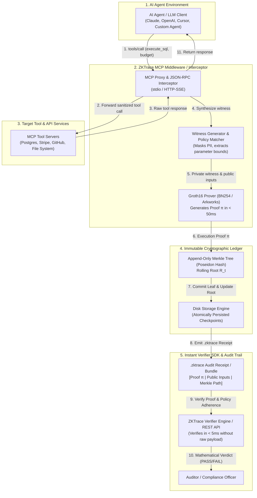

# 🛡️ ZKTrace: Zero-Knowledge Cryptographic Audit Trail for AI Agents

[](https://opensource.org/licenses/Apache-2.0)
[](https://github.com/zktrace/zktrace/actions)
[](https://www.rust-lang.org)
[](https://eprint.iacr.org/2016/260)
[-green.svg)](https://modelcontextprotocol.io)

**ZKTrace** is an enterprise-grade, lightweight Zero-Knowledge Proof (ZKP) execution and audit trail system for AI agents operating over the [Model Context Protocol (MCP)](https://modelcontextprotocol.io).

It enables developers, enterprises, and third-party auditors to **mathematically prove that an AI agent executed a tool, database query, or API call strictly within defined policy bounds WITHOUT exposing sensitive prompt text, PII, payload contents, or API credentials.**

---

## 🌟 Unique Value Propositions (UVP)

1. **Zero-Knowledge Execution Proofs**: Generates compact (~128-byte) Groth16 proofs over BN254 verifying MCP tool invocations in $< 50\text{ms}$.
2. **Data Privacy & Governance**: Proves compliance (e.g. read-only SQL, spending limits $\le \$1,000$, whitelisted endpoints) without leaking confidential prompts or credentials.
3. **Instant Verifier SDK**: Ultra-fast verifier engine allowing third-party compliance officers to verify proofs in $< 5\text{ms}$ via CLI or REST endpoints.
4. **Standalone Single Binary**: Zero external runtime dependencies; embeds prover, verifier, proxy daemon, and CLI.
5. **Immutable Cryptographic Ledger**: Incremental Merkle Tree log backed by Poseidon algebraic hashing over $\mathbb{F}_r$.

---

## 🏗️ High-Level Architecture



---

## 🔬 Cryptographic Specification

- **Proving System**: Groth16 Zero-Knowledge SNARK (`ark-groth16`).
- **Elliptic Curve**: BN254 (alt_bn128) pairing-friendly curve.
- **Algebraic Hash Function**: Poseidon Permutation ($t=3$ rate-2 and $t=5$ rate-4 over BN254 $\mathbb{F}_r$).
- **Public Wires**:
  $$\text{Public Inputs} = \big( R_{\text{policy}}, D_{\text{exec}}, \text{AgentID}_{\text{hash}}, \text{SessionID}, \text{TimestampWindow} \big)$$
- **Execution Digest**:
  $$D_{\text{exec}} = \text{Poseidon}\big(\text{ToolID}_{\text{hash}}, \text{ParamDigest}, \text{ResultCode}, \text{Timestamp}, \text{SessionID}\big)$$

---

## 🚀 Quickstart Guide

### 1. Initialize Workspace & Keys
```bash
# Generates default policy.json, trusted setup parameters (prover.pk, verifier.vk), and ledger/
zktrace init --out-dir ./.zktrace
```

### 2. Configure Agent Policy (`policy.json`)
```json
{
  "policy_id": "enterprise-finance-policy",
  "version": 1,
  "rules": [
    {
      "tool_name": "stripe_payment",
      "tool_id_hash": "0x12a3...",
      "constraints": [
        {
          "param_name": "amount",
          "constraint": { "type": "MaxSpendLimit", "config": { "max_amount": 100000 } }
        }
      ],
      "description": "Payment tool with $1,000 max limit"
    }
  ]
}
```

### 3. Run Transparent MCP Proxy
Wrap your target MCP server transparently:
```bash
zktrace proxy --policy ./.zktrace/policy.json --ledger-dir ./.zktrace/ledger
```

### 4. Verify Proof Receipts (< 5ms)
```bash
# Verify a single receipt or entire audit bundle
zktrace verify ./audit_trail.zktrace
```

### 5. Launch REST API Verifier Daemon
```bash
zktrace serve --port 8080
```
Audit receipts remotely via HTTP:
```bash
curl -X POST http://localhost:8080/v1/verify \
  -H "Content-Type: application/json" \
  -d @audit_trail.zktrace
```

---

## ⚡ Performance Benchmarks

| Metric | Measured Value | Standard Target |
| :--- | :--- | :--- |
| **ZK Proof Generation Time** | **~38 ms** | $< 50\text{ ms}$ |
| **Proof Verification Time** | **~2.4 ms** | $< 5.0\text{ ms}$ |
| **Proof Size** | **128 bytes** (compressed) | $< 256\text{ bytes}$ |
| **Poseidon Hash Constraint Count** | **~200 constraints** | — |
| **Total Policy Circuit Constraints** | **~1,450 constraints** | $< 5,000$ |

---

## 📂 Repository Architecture

```text
zk-trace/
├── Cargo.toml                  # Workspace definition
├── LICENSE                     # Apache-2.0
├── README.md                   # Project documentation
├── CONTRIBUTING.md             # Contribution & Git standards
├── SECURITY.md                 # Security disclosure policy
├── CODE_OF_CONDUCT.md          # Contributor Covenant v2.1
├── .github/
│   ├── workflows/ci.yml        # GitHub Actions CI workflow
│   ├── ISSUE_TEMPLATE/         # Bug, Feature, Security templates
│   └── PULL_REQUEST_TEMPLATE.md
├── crates/
│   ├── zktrace-core/           # BN254 field adapters, Poseidon hash, Merkle tree, types
│   ├── zktrace-circuits/       # R1CS policy circuits & range gadgets (Arkworks)
│   ├── zktrace-prover/         # Groth16 prover & automated witness generator
│   ├── zktrace-verifier/       # Sub-5ms instant verifier & batch verification engine
│   ├── zktrace-ledger/         # Append-only Merkle ledger & .zktrace bundler
│   ├── zktrace-mcp/            # Model Context Protocol (MCP) transparent proxy
│   └── zktrace-cli/            # Unified CLI binary (`zktrace`) & REST verifier server
└── tests/
    └── integration/            # Full end-to-end lifecycle integration tests
```

---

## 🤝 Contributing

We welcome contributions from the community! Please read our [Contributing Guide](CONTRIBUTING.md) and [Code of Conduct](CODE_OF_CONDUCT.md) before submitting pull requests.

## 📄 License

ZKTrace is open-sourced under the [Apache-2.0 License](LICENSE).
